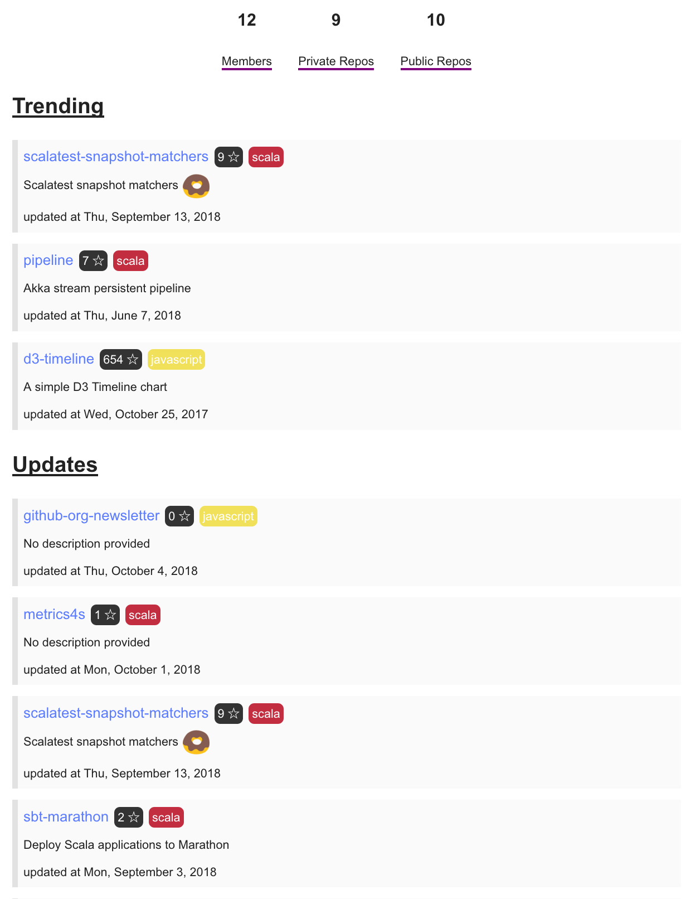

# Github Org Newsletter

|env var|description|
|-------|-----------|
|SMTP_HOST|host of your smtp|
|SMTP_PORT|port of your smtp|
|SMTP_USER|smtp user|
|SMTP_PASSWORD|smtp password|
|EMAIL_TO|comma separated list of emails that will receive this email|
|EMAIL_FROM|from this email|
|GITHUB_TOKEN|your github token|
|GITHUB_ORG|github org that you want to generate for|


## Instructions to run

```bash
docker run \
  -e SMTP_HOST=yourhost \
  -e SMTP_PORT=yourport \
  -e SMTP_USER=youruser \
  -e SMTP_PASSWORD=yoursmtppass \
  -e EMAIL_TO=emailsthatwillreceive \
  -e EMAIL_FROM=emailfrom \
  -e GITHUB_TOKEN=yourgithubtoken \
  -e GITHUB_ORG=yourgithubork \
  commodityvectors/github-org-newsletter:0.1.0 
```

## Example email

